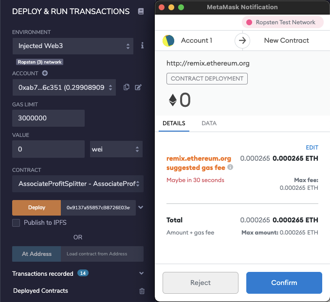

# EtherSmart-Contract
"Looks like we've made our First Contract!"

## Background

Your new startup has created its own Ethereum-compatible blockchain to help connect financial institutions, and the team wants to build smart contracts to automate some company finances to make everyone's lives easier, increase transparency, and to make accounting and auditing practically automatic!

Fortunately, you've been learning how to program smart contracts with Solidity! What you will be doing this assignment is creating 3 `ProfitSplitter` contracts. These contracts will do several things:

* Pay your Associate-level employees quickly and easily.

* Distribute profits to different tiers of employees.

* Distribute company shares for employees in a "deferred equity incentive plan" automatically.

## Files

* [AssociateProfitSplitter.sol](Starter-Code/AssociateProfitSplitter.sol)

* [TieredProfitSplitter.sol](Starter-Code/TieredProfitSplitter.sol)

* [DeferredEquityPlan.sol](Starter-Code/DeferredEquityPlan.sol)

----

1. **Level One:** is an `AssociateProfitSplitter` contract. This will accept Ether into the contract and divide the Ether evenly among the associate level employees. This will allow the Human Resources department to pay employees quickly and efficiently.

First, I have navigated into the [Remix IDE](https://remix.ethereum.org) and created a new contract called `AssociateProfitSplitter.sol`.

Second, while developing and testing my contract, I have used the [Ganache](https://www.trufflesuite.com/ganache) development chain, and point MetaMask to `localhost:8545` to Interface my addresses.

Now, teh Following are some of the variables used in this contract:

* Employee addresses as `payable`.

* Constructor function: within the constructor, I set the employee addresses to equal the parameter values. This will allow me to avoid hardcoding the employee addresses.

Next, I created the following functions for this contract:

* `balance` -- This function is set to `public view returns(uint)`, and returned the contract's current balance. 

* `deposit` -- This function is set to `public payable` check, ensuring that only the owner can call the function.

  * In this function, I have performed the following steps:

    * Set a `uint amount` to equal `msg.value / 3;` in order to calculate the split value of the Ether.

    * Transfer the `amount` to `employee_one` and repeated the same previous steps for `employee_two` and `employee_three`.

    * I have deal with wei leftover, so I have transfered the `msg.value - amount * 3` back to `msg.sender`, to Human Resources.

* I have created a fallback function using `function() external payable`, and call the `deposit` function from within it. This will ensure that the logic in `deposit` executes if Ether is sent directly to the contract. This is important to prevent Ether from being locked in the contract since we don't have a `withdraw` function in this use-case.

### Test the contract:

In the `Deploy` tab in Remix, I have deployed the contract to my local Ganache chain by connecting to `Injected Web3` and ensuring MetaMask is pointed to `localhost:8545`.

I have filled in the constructor parameters with designated `employee` addresses.

Then, I have test the `deposit` function by sending various values. Keep an eye on the `employee` balances as you send different amounts of Ether to the contract and ensure the logic is executing properly.

- Injected Web3 with Ropsten:

  

2. **Level Two:** is a `TieredProfitSplitter` that will distribute different percentages of incoming Ether to employees at different tiers/levels. For example, the CEO gets paid 60%, CTO 25%, and Bob gets 15%.

In this contract, rather than splitting the profits between Associate-level employees, I have calculated rudimentary percentages for different tiers of employees (CEO, CTO, and Bob).

**Variables & functions:**

* `Deposit` function, which will calculate the number of points/units by dividing `msg.value` by `100`. The `uint amount` variable will store the amount to send each employee temporarily. Then, I have transferred the `amount` to `employee_one`. And repeated these steps for each employee.

* I have sent the remainder to the employee with the highest percentage by subtracting `total` from `msg.value`, and sending that to an employee.

* Finilly, I have deployed and test this contract functionality by depositing various Ether values (greater than 100 wei).

- Deploy using Ropsten:

- Deposit ETH: 

3. **Level Three:** is a `DeferredEquityPlan` that models traditional company stock plans. This contract will automatically manage 1000 shares with an annual distribution of 250 over 4 years for a single employee.

In this contract, I managed an employee's "deferred equity incentive plan" in which 1000 shares will be distributed over 4 years to the employee. 

* **A two-minute primer on deferred equity incentive plans:** In this set-up, employees receive shares for joining and staying with the firm. They may receive, for example, an award of 1,000 shares when joining, but with a 4 year vesting period for these shares. This means that these shares would stay with the company, with only 250 shares (1,000/4) actually distributed to and owned by the employee each year. If the employee leaves within the first 4 years, he or she would forfeit ownership of any remaining (“unvested”) shares.

**Variables & functions:**

* Human Resources set in the constructor as the `msg.sender`.

* Below the `employee` initialization variables at the top (after `bool active = true;`), set the total shares and annual distribution:

* The `uint start_time = now;` line permanently stores the contract's start date. 

* The `uint public distributed_shares` will track how many vested shares the employee has claimed and was distributed. By default, this is `0`.

* In the `distribute` function:

  * Added the following `require` statements:

    * Require that `unlock_time` is less than or equal to `now`.

    * Require that `distributed_shares` is less than the `total_shares` the employee was set for.

  * After the `require` statements, add `365 days` to the `unlock_time`. This will calculate next year's unlock time before distributing this year's shares. We want to perform all of our calculations like this before distributing the shares.

  * Next, I set the new value for `distributed_shares` by calculating how many years have passed since `start_time` multiplied by `annual_distributions`. 

  * The final `if` statement provided checks that in case the employee does not cash out until 5+ years after the contract start, the contract does not reward more than the `total_shares` agreed upon in the contract.

* Deploy and test your contract locally.

  * For this contract, I have tested the timelock functionality by adding a new variable called `uint fakenow = now;` as the first line of the contract, then Ii replaced every other instance of `now` with `fakenow`. Utilize the following `fastforward` function to manipulate `fakenow` during testing.

 

  * I have added this function to "fast forward" time by 100 days when the contract is deployed (requires setting up `fakenow`):

 

  * Once I was satisfied with my contract's logic, I reverted the `fakenow` testing logic.

- Deploy the contracts to a live Testnet:

- Deposit:

 

* Congratulate yourself for building such complex smart contracts in your first week of Solidity! You are learning specialized skills that are highly desired in the blockchain industry!

